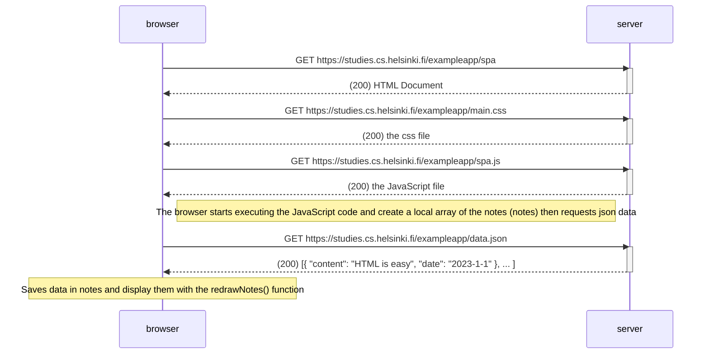

```mermaid
sequenceDiagram
    participant browser
    participant server

    browser->>server: GET https://studies.cs.helsinki.fi/exampleapp/spa
    activate server
    server-->>browser: (200) HTML Document
    deactivate server

    browser->>server: GET https://studies.cs.helsinki.fi/exampleapp/main.css
    activate server
    server-->>browser: (200) the css file
    deactivate server

    browser->>server: GET https://studies.cs.helsinki.fi/exampleapp/spa.js
    activate server
    server-->>browser: (200) the JavaScript file
    deactivate server

    Note right of browser: The browser starts executing the JavaScript code and create a local array of the notes (notes) then requests json data

    browser->>server: GET https://studies.cs.helsinki.fi/exampleapp/data.json
    activate server
    server-->>browser: (200) [{ "content": "HTML is easy", "date": "2023-1-1" }, ... ]
    deactivate server

    note over browser: Saves data in notes and display them with the redrawNotes() function

```