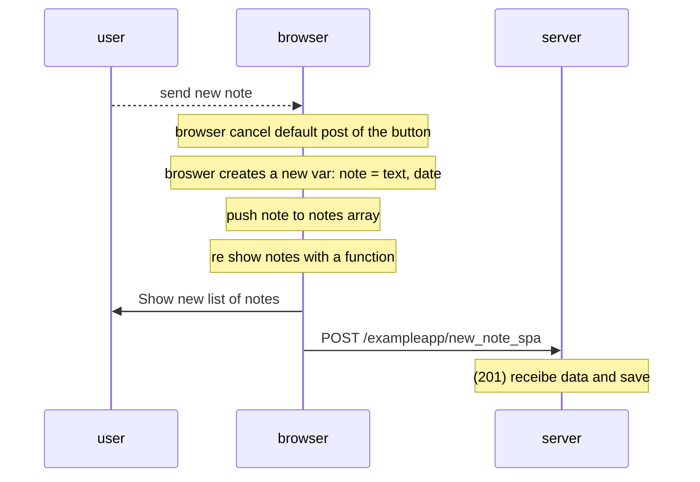

```mermaid
sequenceDiagram
    participant user
    participant browser
    participant server

    user-->> browser: send new note
    note over browser: browser cancel default post of the button
    note over browser: broswer creates a new var: note = text, date
    note over browser: push note to notes array
    note over browser: re show notes with a function
    browser->>user: Show new list of notes
    browser->>server: POST /exampleapp/new_note_spa
    note over server: (201) receibe data and save
```