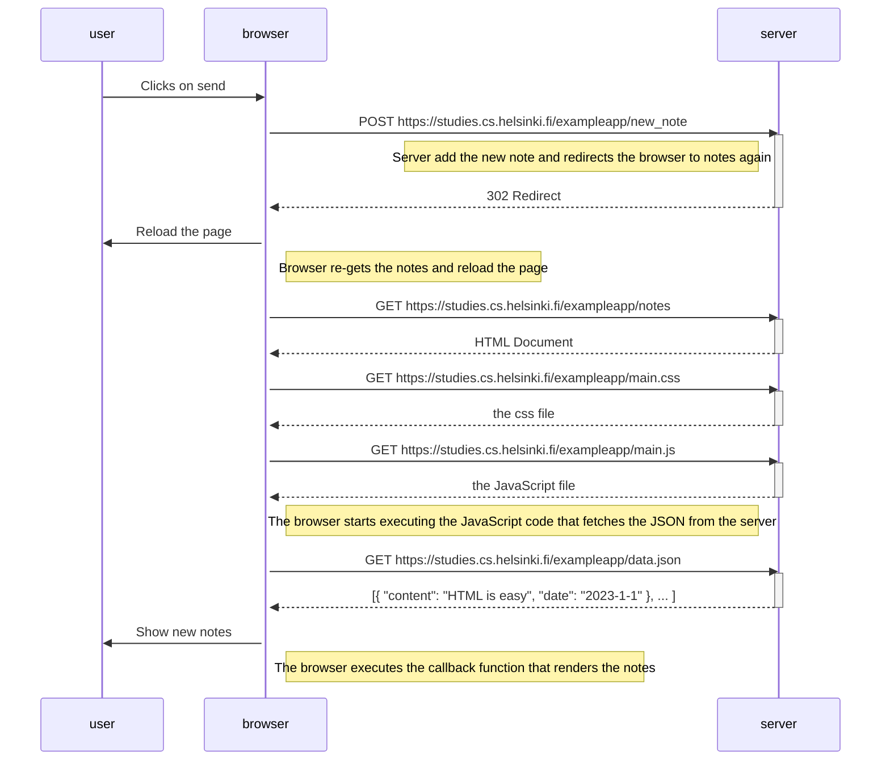

```mermaid
sequenceDiagram
    participant user
    participant browser
    participant server

    user->>browser: Clicks on send
    activate browser
    browser->>server: POST https://studies.cs.helsinki.fi/exampleapp/new_note
    activate server
    #The browser sends the new note data (text from the input) and the server create a new object with the text and Date of the note and "save" him.
    #Then the server redirects the browsers to "notes" again
    Note left of server: Server add the new note and redirects the browser to notes again
    server-->>browser: 302 Redirect
    deactivate server

    browser->>user: Reload the page

    #Again all
    Note right of browser: Browser re-gets the notes and reload the page
    browser->>server: GET https://studies.cs.helsinki.fi/exampleapp/notes
    activate server
    server-->>browser: HTML Document
    deactivate server

   browser->>server: GET https://studies.cs.helsinki.fi/exampleapp/main.css
    activate server
    server-->>browser: the css file
    deactivate server

    browser->>server: GET https://studies.cs.helsinki.fi/exampleapp/main.js
    activate server
    server-->>browser: the JavaScript file
    deactivate server

    Note right of browser: The browser starts executing the JavaScript code that fetches the JSON from the server

    browser->>server: GET https://studies.cs.helsinki.fi/exampleapp/data.json
    activate server
    server-->>browser: [{ "content": "HTML is easy", "date": "2023-1-1" }, ... ]
    deactivate server
    browser->>user: Show new notes

    Note right of browser: The browser executes the callback function that renders the notes

```